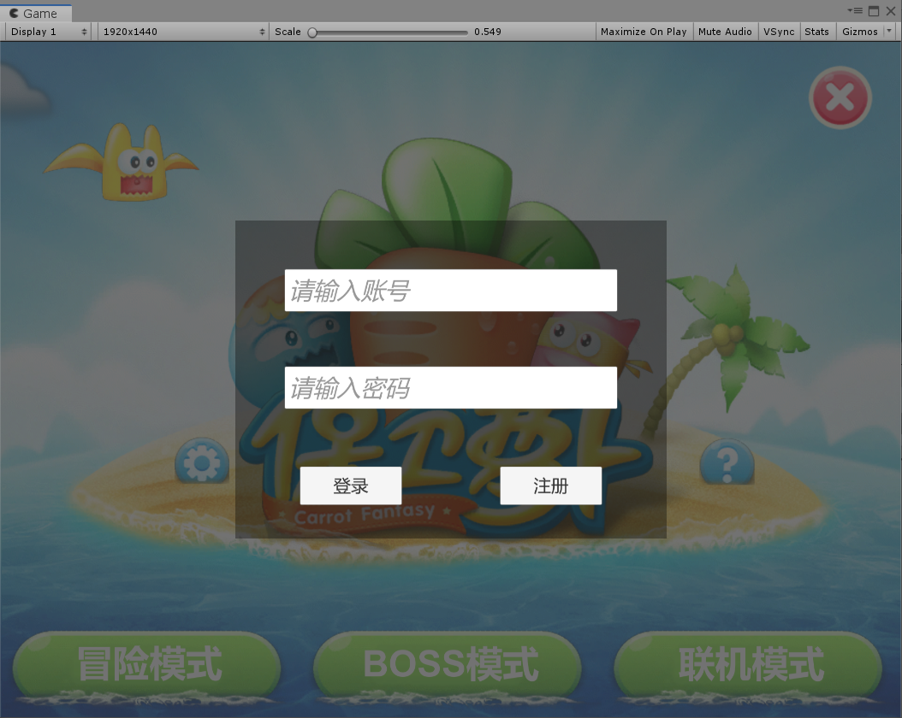
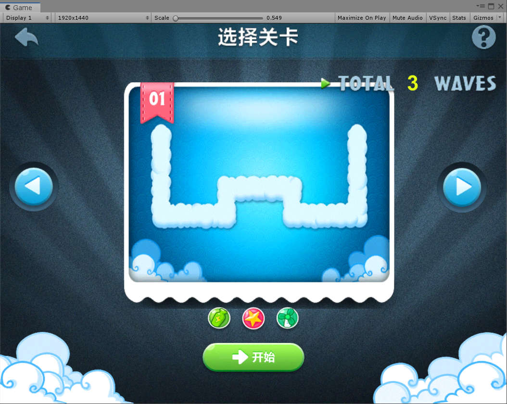
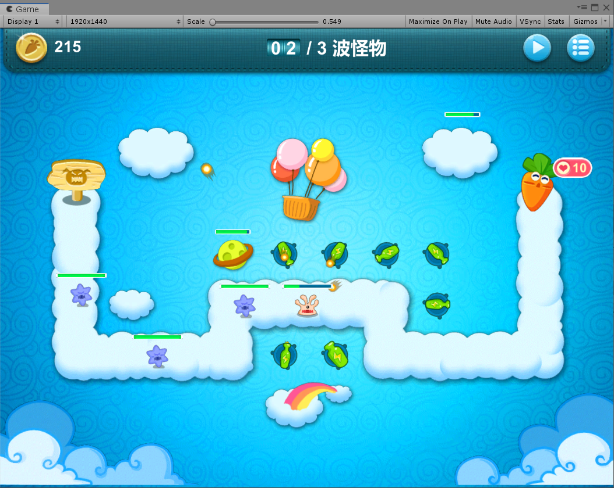
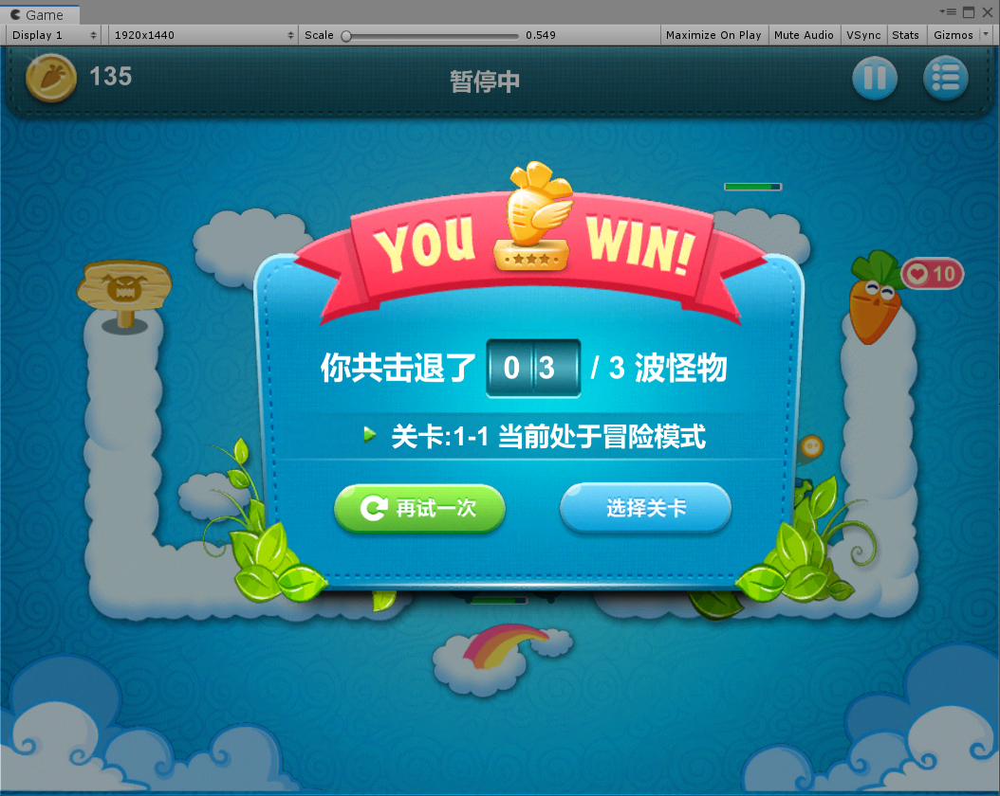

# CarrotFantasyClient1
 保卫萝卜（毕设）
 
 包含客户端与服务端  
 1.客户端采用Unity和C#语言开发，服务端使用egametang框架辅助开发，网络协议使用ProtoBuf。  
 2.客户端采用MVC模式进行业务的开发，使用UGUI与DoTween完成UI的搭建。  
 3.核心战斗采用有限状态机进行流程控制，使用观察者模式实现数据与表现分离。  
 4.核心战斗采用组件式设计实现游戏功能，如碰撞检测，物体位移。  

效果展示  

